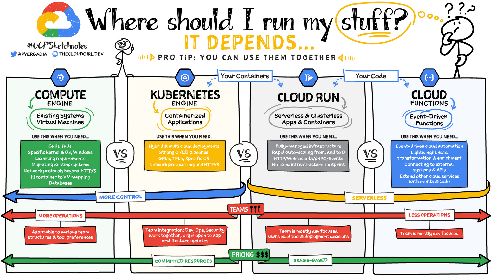
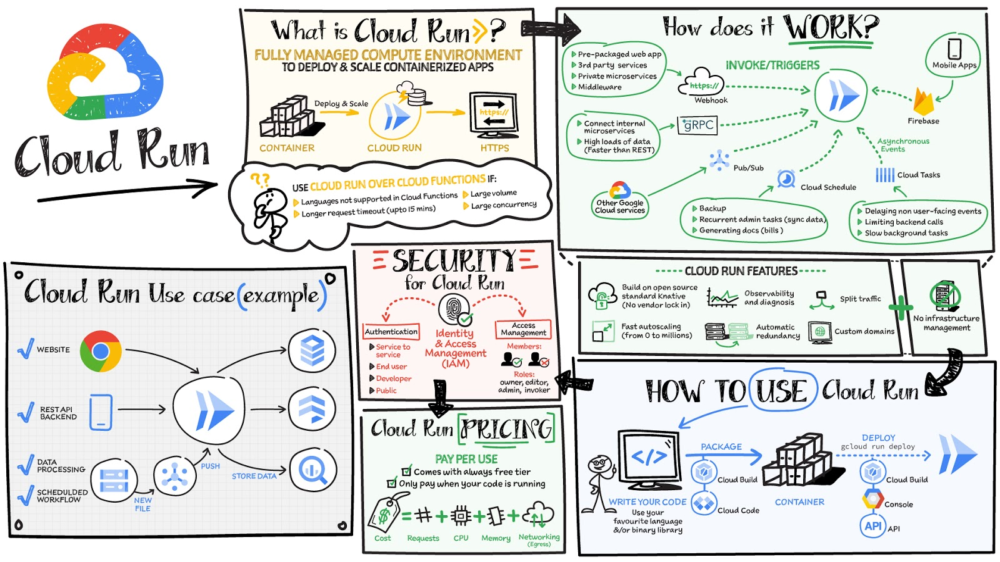
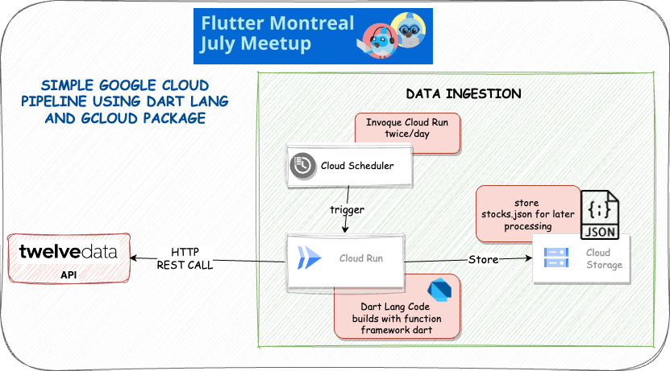

###  Building a Google Cloud Pipeline with Dart Lang and F.a.a.S

July Flutter Meetup

---

####    About me  

- <a href="https://g.dev/bwnyasse" target="_blank"> https://g.dev/bwnyasse </a>

- Senior Director, Software Development @Datavalet

- Dart & Flutter GDE

- Former Google Cloud Premier Partner

---

###   Overview of Google Cloud Platform (GCP)  

---

###   Overview of Google Cloud Platform (GCP)  

- Scalable and flexible cloud platform 

- <a href="https://googlecloudcheatsheet.withgoogle.com/" target="_blank"> https://googlecloudcheatsheet.withgoogle.com/</a>

---

####    Introduction to FaaS (Function as a Service)  

-  FaaS: Serverless computing paradigm

-  Benefits: 
  - Automatic scaling
  - Reduced operational complexity
  - Cost optimization

-  Key FaaS platforms: 
  - Cloud Functions (GCP)
  - AWS Lambda (Amazon Web Services)
  - Azure Functions (Microsoft Azure)

---

####    How to write a Native Cloud Function as Dart Developer ...  

- <a href="https://cloud.google.com/functions/docs/writing#directory-structure-nodejs" target="_blank"> on GCP ...</a>

  

---

####    CaaS vs. FaaS  

## CaaS (Container as a Service)

- CaaS provides a platform for running containers without managing the underlying infrastructure.

- Key features of CaaS:
  - Container orchestration 
  - Scalable infrastructure 

---

####    Cloud Run vs Cloud Function 

  

---

####    Cloud Run  

  

---

####    Demo Architecture Overview  

  

---

####    Demo Application Walkthrough  

Step-by-step demonstration of the application:

  1. Fetching data from  the external API 
  2. Processing and manipulating the data using CaaS ( Cloud Run) 
  3. Storing the data in Cloud Storage
  4. Scheduling application execution with Cloud Scheduler
  5. Showing real-time execution and results

---

####  Key Development Tools  

- <a href="https://pub.dev/packages/functions_framework" target="_blank">functions_framework</a>:
  - An open-source FaaS (Function as a Service) framework for writing portable Dart functions.

- <a href="https://pub.dev/packages/gcloud" target="_blank">gcloud</a>:
  - A Google Cloud Platform support package for Dart, providing APIs and utilities for GCP services.

- <a href="https://cloud.google.com/code/docs/vscode#docs" target="_blank">Cloud Code for VS Code</a>:
  - IDE support for the full development cycle of Kubernetes and Cloud Run applications.

---

####   Hands-on Coding  

It's time to dive into some code!

---

####   Key Takeaways  

- Building a Google Cloud Pipeline with Dart and FaaS:

  - Leverages Dart's modern features for web and mobile app development

  - Takes advantage of FaaS for serverless computing benefits

  - Utilizes GCP services like Cloud Run, Cloud Storage, and Cloud Scheduler

---

####   Q&A   

<a href="https://g.dev/bwnyasse" target="_blank">Contact Me</a>
